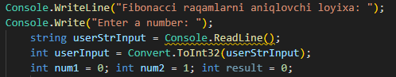
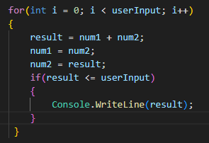

# Fibonacci sonlarni aniqlab beruvchi dastur
----
***ushbu kichik loyixa orqali Fibonacci raqamlarni aniqlashingiz mumkin:***

>Fibonacci sonlar quyidagicha tariflanadi: Avvalgi ikki elementni 1 ga teng bolib, 3 - elementdan boshlab ***xar bir element ozidan oldinga ikki yigindisiga teng*** qonuniyati asosida tuzilgan ketma-ketlikka Fibonacci ketma-ketligi, bu sonlarni esa, [Fibonacci sonlari deyiladi](https://uz.wikipedia.org/wiki/Fibonacci_sonlari)

# Birinchi qism

# Ikkinchi qism

